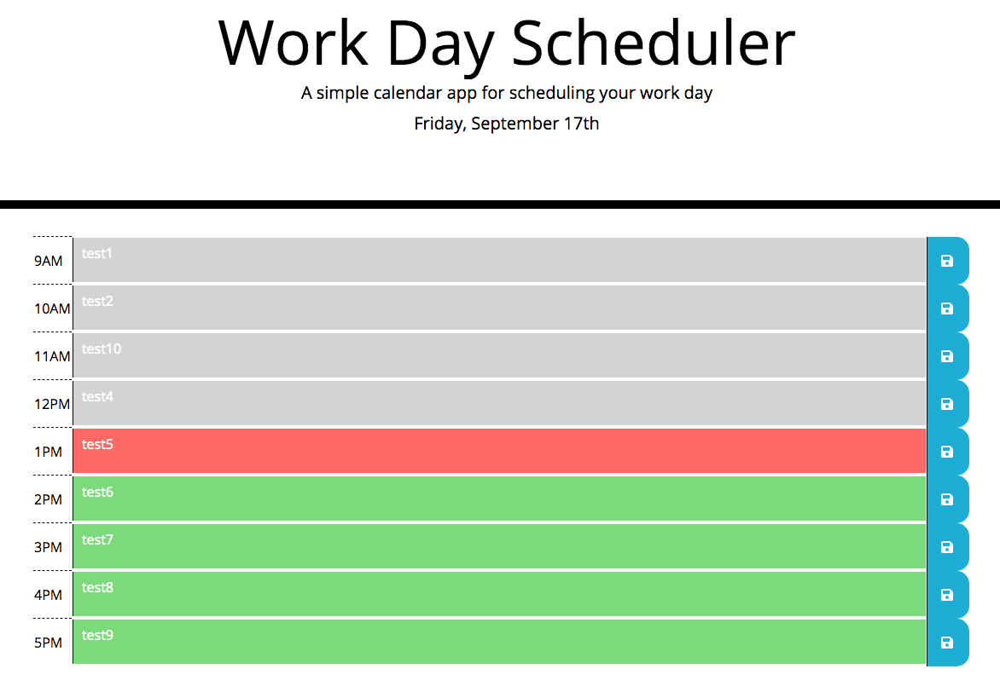

# Work Day Scheduler
homework_wk5

Week 5 homework was to create a simple calendar application that allows a user to save events for each hour of the day by modifying the starter code. The app runs in the browser and features dynamically updated HTML and CSS powered by jQuery.

A challenge put forward by the Assistant was that the script could be written in less than 30 lines. I achieved it in 27.

https://jonmorg-hs.github.io/Work_Day_Scheduler/

